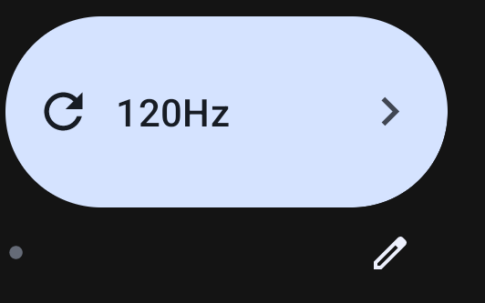

 
<h1> <strong>NotHz RefreshRate Control </strong> </h1>

Simple app to change Nothing Phone (1) Refresh rate (60Hz/90Hz/120Hz) without ADB or root. 
Thanks to Max Weinbach for finding this tweak, Rohit Shetty for testing this app and everyone who worked on PhoenixRefreshRateControl which this is based on.

This app also includes qs tile for setting 60Hz, 90Hz and 120Hz. Check in your quick settings panel to add it.

Info: This app targets older android sdk in order to set refresh rates without ADB requirement. Ignore the dialog that says "This app was built for an older version of Android...." and Google Play Protect false positive warning.
Also it cannot stretch to 20:9 aspect ratio as the old SDK supports only 16:9 as it seems, so there is black bar at the bottom of the screen.

<strong>QS tile changes refresh rate and shows current one</strong>

<strong>Screenshot</strong>

